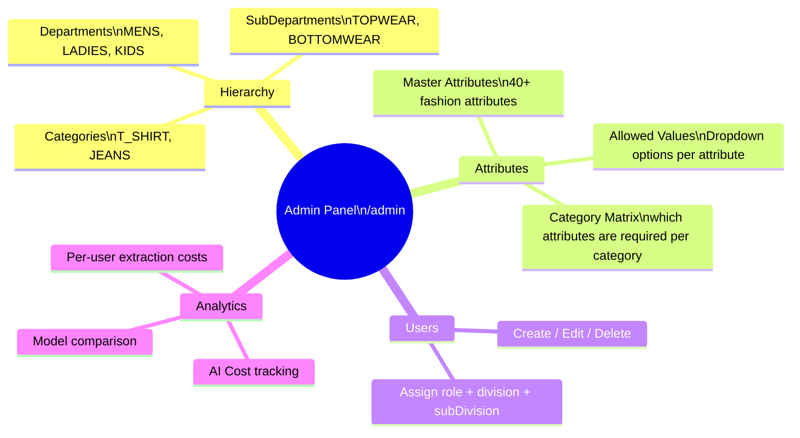

# Admin Panel

#admin #hierarchy #attributes #users

← [[00 - Index]]

---

## What the Admin Panel Manages



---

## Hierarchy Management

**Endpoint prefix**: `/api/admin/`

```
GET/POST/PUT/DELETE  /departments
GET/POST/PUT/DELETE  /sub-departments  (filter: ?departmentId=)
GET/POST/PUT/DELETE  /categories       (filter: ?subDepartmentId=)
```

**3-level hierarchy**:
```
Department (MENS)
  └── SubDepartment (TOPWEAR)
        └── Category (T_SHIRT)
              └── CategoryAttribute (which attributes are required)
```

---

## Master Attributes

Each attribute has:
```
key                  — e.g. "neck", "weave", "gsm"
label                — Display label e.g. "Neck Type"
type                 — TEXT | SELECT | NUMBER
description          — Human description
displayOrder         — Sort order in UI
isActive             — Show/hide in extraction
confidenceThreshold  — Min AI confidence to accept value (0.0-1.0)
rangeConfig          — For NUMBER type: {min, max}
validationRules      — Custom validation JSON
```

---

## Attribute Allowed Values

Per attribute, a list of valid dropdown values:
```
shortForm     — e.g. "rn"
fullForm      — e.g. "round neck"
aliases       — ["ROUND", "ROUNDED"]
displayOrder  — Sort order
```

When AI extraction runs, it matches its output against these values (tokenization + alias matching).

---

## Users Management

**Endpoint**: `/api/admin/users`

| Action | Endpoint |
|--------|---------|
| List all users | GET /api/admin/users |
| Create user | POST /api/admin/users |
| Update user | PUT /api/admin/users/:id |
| Delete user | DELETE /api/admin/users/:id |

Fields managed:
- email, password (bcrypt), name, role
- division, subDivision (scoping for APPROVER/CATEGORY_HEAD)

**UI** (`features/admin/pages/UsersManagement.tsx`, redesigned 2026-10-07 — option A of a 5-option canvas):
- Toolbar: search (name, email, division, sub-division, role) · role chips with counts (roles present in
  the current status+search set) · status switch **All / Active / Inactive**, default **Active** (the page
  used to hide deactivated users entirely; they are now viewable, faded).
- Columns: User (initials + name + email) · Role (colour by family: admin slate, approvers/heads blue,
  creators green, PO committee violet, planning amber, PD pink) · Access scope (division names + first 6
  sub-division chips, "+N more" expands in place; ADMIN = "All access") · Business division · Last login
  (relative + exact; "Never signed in") · Status (dot) · Actions (Edit, Deactivate icon buttons).
- 25 rows per page by default with a size changer. Bulk upload unchanged.
- **Add / Edit user dialog** (option A of a 5-option canvas): sections Account · Role · Access scope.
  Email is shown locked when editing; the password field hides behind "Set a new password" on edit (always
  shown on create). Role labels are humanised (values unchanged). Access scope (only for CREATOR / APPROVER /
  CATEGORY_HEAD / SUB_DIVISION_HEAD, sub-divisions only for CREATOR / APPROVER / SUB_DIVISION_HEAD) is
  `AccessScopeEditor`: division toggle buttons ("3/7", "Add"), then per division a chip grid of sub-division
  codes with Select all / Clear all. Codes held that no selected division lists show under "Other codes".
  Turning a division off still goes through `handleDivisionChange` → "Remove Division" confirm.
  Footer: Deactivate user (not self, active only) · Cancel · Save changes. All states slate, not coral.

---

## Analytics / Expenses

**Route**: `/admin/expenses`  
**Data**: `CostSummary` table

Tracks per extraction:
- `tokensUsed` — tokens consumed
- `costUsd` — estimated cost
- `modelUsed` — which AI model
- `processingTimeMs` — latency

Views:
- Cost overview (total, per day)
- Model comparison (Claude vs GPT-4o)
- Per-category cost breakdown
- Per-user breakdown

### Admin Dashboard layout (`pages/Admin.tsx`, redesigned 2026-10-07 — option A)

Building blocks in `features/admin/components/DashboardParts.tsx`:
- **JumpNav** — sticky "On this page" menu: Pipelines · Vendor sync · Master data (18) · Analytics
  (sections have ids `pipelines`, `vendor`, `masters`, `analytics`).
- The old Total / Completed / Failed / Pending counter tiles were removed at the user's request, and with them
  the whole stats API: `GET /api/admin/stats` (`adminController.getDashboardStats`, 4 COUNTs on
  extraction_results_flat), `backendApi.getAdminStats`, `adminApi.getDashboardStats`, the unused
  `useDashboardStats` hook, both `DashboardStats` types and the `test-admin-stats.ts` / `test-api-stats.js` scripts.
- **Pipelines** — one card, a `PipelineRow` each for `raw_articles`, `fabric_raw_data`, `gm_raw_data`
  (stacked progress bar + counts, View data, the original run Popconfirm), plus the SRM fetch tool
  (by date / by PPT number) at the bottom.
- **Vendor sync** — one compact row (records, last sync, source, View data, refresh, Sync now Popconfirm).
- **Master data** — 18 `MasterDataCard`s in collapsible `MasterGroup`s: Attributes & grids (7), GM (2),
  Fabric & body (4), Costs (3), Hierarchy & menus (2). Each card shows status (Uploaded / Not uploaded /
  Unknown), rows, last upload, and Upload / View / Download / Template / refresh. **Upload** expands the card
  (full width) to show its original status details + upload panel; it stays expanded while that upload runs
  (Hierarchy also while a preview awaits confirmation). Upload logic per card is unchanged.
  `MASTER_DATA_COUNT` in Admin.tsx must be updated if a card is added.
- **Analytics** — expense / image overview and the detailed tables at the end (the static "Admin Overview"
  help card and the "Debug Info" card were removed).

### View Data page (`pages/ExpenseTableDetailPage.tsx`, option E)

Breadcrumb back to the dashboard (or Expense Data for non-admins), title + row count + description, actions
(Change requests, Download master, Propose new row), the approval rule as a slim note, a toolbar (search on
Enter, active column filters as removable chips, sort + direction), the table with outlined propose-edit /
propose-delete icons, and the request form as an inline **side panel** (`RowChangeRequestDialog`
`variant="panel"`, keyed by row so each row gets a fresh form). In edit mode each field shows "Current: …"
and marks "· changed". The dialog variant is still the default for other callers.

---

## Mandatory Grid Sync Script

**Script**: `Backend/scripts/sync-mandatory-grid.ts`

Reads `Backend/data/MANDATORY GRID DATA.xlsx` and:
1. Writes `Frontend/src/data/maj-cat-mandatory.json` (JSON array per major category)
2. Updates `CategoryAttribute.isRequired` in DB for every category/attribute pair

Run:
```bash
cd Backend
ts-node scripts/sync-mandatory-grid.ts
# Flags:
#   --json-only   Only write JSON, skip DB
#   --db-only     Only update DB, skip JSON
#   --dry-run     Print changes without writing
```
