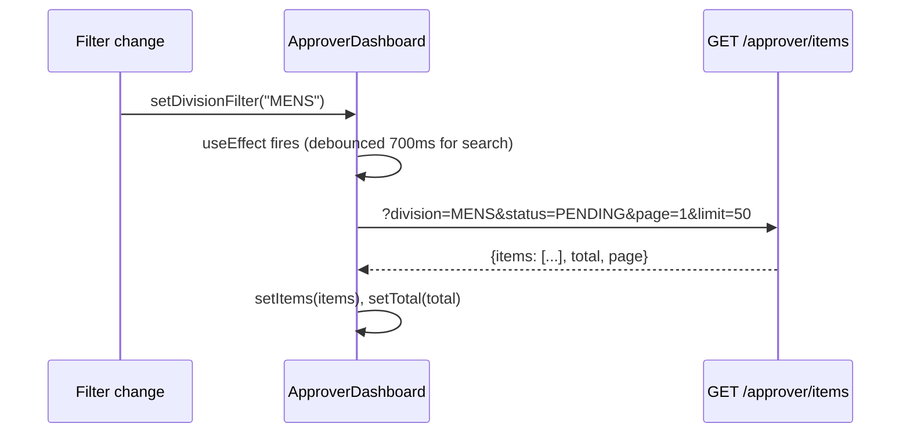

# Frontend Architecture

#frontend #react #components #pages

← [[00 - Index]]

---

## Page / Route Map

```mermaid
flowchart LR
    subgraph PUBLIC["Public"]
        LOGIN[/login]
        REG[/register]
    end

    subgraph CREATOR["Creator (non-approver)"]
        DASH[/dashboard]
        PROD[/products]
        EXT[/extraction/simplified]
        PROF[/profile]
    end

    subgraph APPROVER_ROUTES["Approver"]
        APPR[/approver → New Articles]
        APPR_OLD[/approver/old-articles]
        APPR_REJ[/approver/rejected]
        PO[/po-presentation]
    end

    subgraph ADMIN_ROUTES["Admin only"]
        ADM[/admin/dashboard]
        HIER[/admin/hierarchy]
        USERS[/admin/users]
        EXP[/admin/expenses]
    end
```

---

## Feature Modules (`Frontend/src/features/`)

| Feature | Path | Key components |
|---------|------|---------------|
| `approver` | `features/approver/` | ApproverDashboard, ApproverArticleList, ApproverTable, VariantSubTable |
| `extraction` | `features/extraction/` | SimplifiedExtractionPage, AttributeTable, AttributeCell |
| `admin` | `features/admin/` | AttributeManager, CategoryManager, UsersManagement, HierarchyManagement |
| `analytics` | `features/analytics/` | CostOverview, ModelComparison, CategoryCostTable |
| `dashboard` | `features/dashboard/` | Dashboard, Products, UploadsList, UploadDetail |
| `auth` | `features/auth/` | Login, Register |
| `po-presentation` | `features/po-presentation/` | POPresentationPage |

---

## Article list dashboards — shared card grid (2026-10-06)

All five list dashboards — `ApproverDashboard` (FG Articles: New/Old/Rejected/Created/Failed),
`FabricArticleDashboard`, `FGNewArticleDashboard`, `BodyArticleDashboard`, `GMArticleDashboard` —
render their cards through one shared module in `shared/components/articles/`:

```
<Dashboard>
├── Brand strip: title · count · actions, then DivisionTabs (All / Mens / Ladies / Kids)
├── Filter row (all controls h-9): search · [status] · sub-div · major category · [source]
│   · DatePresetFilter (Any / Today / 7 days / 30 days / Custom…) · ── spacer ── · GroupByControl
│   └── line 2: [Created tab: SapSyncChips (All / Synced / Queued / Failed)] · ── · ResetFiltersButton · Select page
│       Selected segments/chips use dark slate (ACTIVE_SEGMENT_CLASS), not the coral primary.
│       Filter-row fields override the theme's coral hover/focus/open ring with slate classes
│       (hover:border-slate-400, focus-visible / focus-within / data-[state=open] → border-slate-500 + ring-slate-400/25).
└── ArticleCardGrid           ← flat grid, or collapsible groups
    ├── group header: vendor initials / category icon, count, cost range,
    │                  "N missing MRP", Select all / Deselect all, collapse
    └── ArticleSpecCard × N   ← "Spec Sheet" card (design option B)
        ├── 3:4 photo (click → zoom/rotate/pan dialog)
        ├── Division › Sub-div, Major category, select checkbox
        ├── badges: status (not shown for PENDING), article no., SAP sync
        ├── Design no. · Added/Approved date · Vendor (+code, 2-line wrap)
        ├── Cost | MRP | Margin %  (amber "No MRP" when cost set, MRP null)
        └── selected / hover / focus = slate border + ring-slate-400/25, checkbox accent-slate-800 (no coral)
```

- The four old per-feature cards (`ArticleCard`, `FabricArticleCard`, `BodyArticleCard`, `GMArticleCard`) were deleted.
- `useArticleGroupBy(storageKey, ?groupBy)` — choice seeded from URL, then localStorage
  (`articleGroupBy:/approver`, `:fabric`, `:fabric-fg`, `:body`, `:gm`), default `none`.
- When grouped the dashboard sends `groupBy=vendor|category` to its list endpoint; the backend
  (`ApproverController.findGroupedPage`) orders groups (`vendorCode` or `majorCategory`) by their **newest**
  article — createdAt, or approvedAt on Created — so today's vendor/category is on page 1, rows newest-first
  inside a group. It runs a Prisma `groupBy` (_max date, _count), sorts groups in JS, then fetches only the
  group slices on the requested page; a group stays together across the 50-per-page pagination. Vendor groups key on **vendor code** (one name can have
  several codes, e.g. V2 SMART 302099 / 201082).
- Filter pieces live in `shared/components/articles/ArticleFilters.tsx` (filter bar design option C). Division
  tabs replace the old Division select (shown under the same `showDivisionFilter || isUnscoped` rule).
  `DatePresetFilter` writes the dashboards' existing `dateRangeFilter`, so fetch / URL / export code is unchanged;
  the active preset is inferred from the stored range. Reset clears every filter (not status on Created) and
  remounts the uncontrolled search input via a `searchKey`.
- Margin = (MRP − cost) / MRP. Fabric list rows carry `rate: null` (their rate column is mapped to `mrp`), so Fabric cards show Cost "—".

## Key Component Hierarchy (Approver Flow)

```
ApproverDashboard.tsx
├── Filter bar (status, division, subDivision, majorCategory, dateRange, search)
├── Export button
├── ApproverArticleList.tsx  ← Card grid view
│   ├── Article card × N
│   │   ├── Image thumbnail
│   │   ├── Status badge
│   │   ├── PPT number / design number
│   │   ├── 4 collapsible attribute groups (FAB / BODY / VA ACC / VA PRCS)
│   │   │   └── Inline dropdown per field
│   │   ├── impAtrbt2 dropdown (always shown, mandatory)
│   │   ├── Edit button → Modal
│   │   ├── Approve / Reject buttons (PENDING only)
│   │   ├── Create Fabric Article button  ⚠️ 404 — no backend route
│   │   ├── Create Body Article button    ⚠️ 404 — no backend route
│   │   └── Proceed FG Article button     ⚠️ 404 — no backend route
│   └── VariantSubTable.tsx  (expandable)
│       ├── Size × Color grid
│       └── Add Color dialog
└── ApproverTable.tsx  ← Table view (alternative)
```

---

## State Management

- **TanStack Query** — server state (article list, attribute dropdowns, variants)
- **React useState** — local UI state (filters, modal open/close, editing item)
- **Optimistic updates** — applied immediately on field change, synced from server response
- **localValues cache** — temporary map of `{itemId: {field: value}}` for UI consistency
  - Cleared on server response sync to avoid stale values

---

## Data Flow: Article List Load



---

## Key Data Files (`Frontend/src/data/`)

| File | What it drives |
|------|---------------|
| `majCatAttributeMap.ts` | `getMajCatMandatoryKeys(majorCat)` — which fields are required |
| `majCatAttributeMap.ts` | `getMajCatAllowedValues(division, schemaKey)` — dropdown options |
| `majorCategoryMcCodeMap.ts` | `getMcCodeByMajorCategory()` — MC code lookup |
| `maj-cat-mandatory.json` | JSON version of mandatory keys (synced from Excel) |
| `majorCategoryMap.ts` | Full major category list with shortForm / fullForm |

---

## API Service Layer

**File**: `Frontend/src/constants/app/config.ts`  
`APP_CONFIG.api.baseURL` — all fetch calls use this base URL.

```typescript
// Example from ApproverDashboard
const response = await fetch(`${APP_CONFIG.api.baseURL}/approver/items?${params}`);
```

Token from `localStorage.getItem('authToken')` attached as `Authorization: Bearer <token>`.

---

## Attribute Value Caching

**File**: `Frontend/src/services/articleConfigService.ts`

- `preloadAttributeValues(division)` — fetches all dropdown values from `GET /api/article-config`
- `getCachedValues(division, schemaKey)` — returns cached dropdown options
- Used in card inline edit dropdowns and modal select fields
- Cached in module-level map, not re-fetched per card

---

## Export to Excel

**File**: `Frontend/src/shared/utils/export/extractionExport.ts`

- `GET /api/approver/items/export-all` — fetches all records matching current filters (no pagination)
- Maps to 60+ column Excel sheet
- Includes: all attribute fields, business fields, SAP sync status
- File name varies by pathType: "Old Articles", "New Articles", "Rejected Articles"
